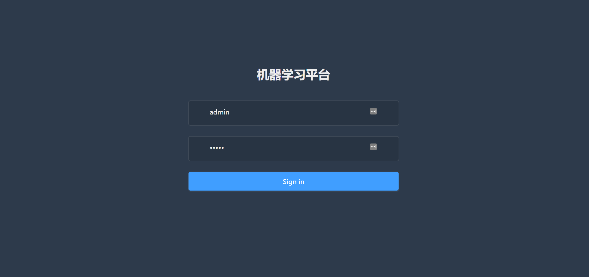

# 机器学习平台


## 开发工具
本项目使用vscode开发。vscode可以使用java开发前端，也可以使用js开发前端。

## 后端

后端使用Spring boot进行开发。

### 依赖

后端开发使用jdk8，运行环境需要配置好jdk8。如果使用vscode，还需要安装必要的java插件。

## 前端

前端使用Vue进行开发，需要安装node.js。配置好node环境后，运行:
```
npm --version
```
可以看到node的信息


## 运行

### 运行后端
后端运行在8080端口，请确定8080端口没被占用。

在后端根目录下,先:
```
mvn clean install
```
在启动Spring Boot App:
```
mvn run
```

如果出现下载失败的情况，很可能是网络访问问题，添加国内镜像即可解决

修改maven conf 文件夹下的 setting.xml文件如下：
```
<mirrors>
    <mirror>
      <id>alimaven</id>
      <name>aliyun maven</name>
      <url>http://maven.aliyun.com/nexus/content/groups/public/</url>
      <mirrorOf>central</mirrorOf>        
    </mirror>
  </mirrors>
```
### 运行前端

在前端根目录下,运行:
```
npm run serve
```

如果出现错误，则根据错误信息，安装所需的包。

点击[http://127.0.0.1:8299/](http://127.0.0.1:8299/)，看到如下界面则说明没有问题。




## 项目详细介绍

[后端](./admin/Readme.md)

[前端](./vue_admin/README.md)


